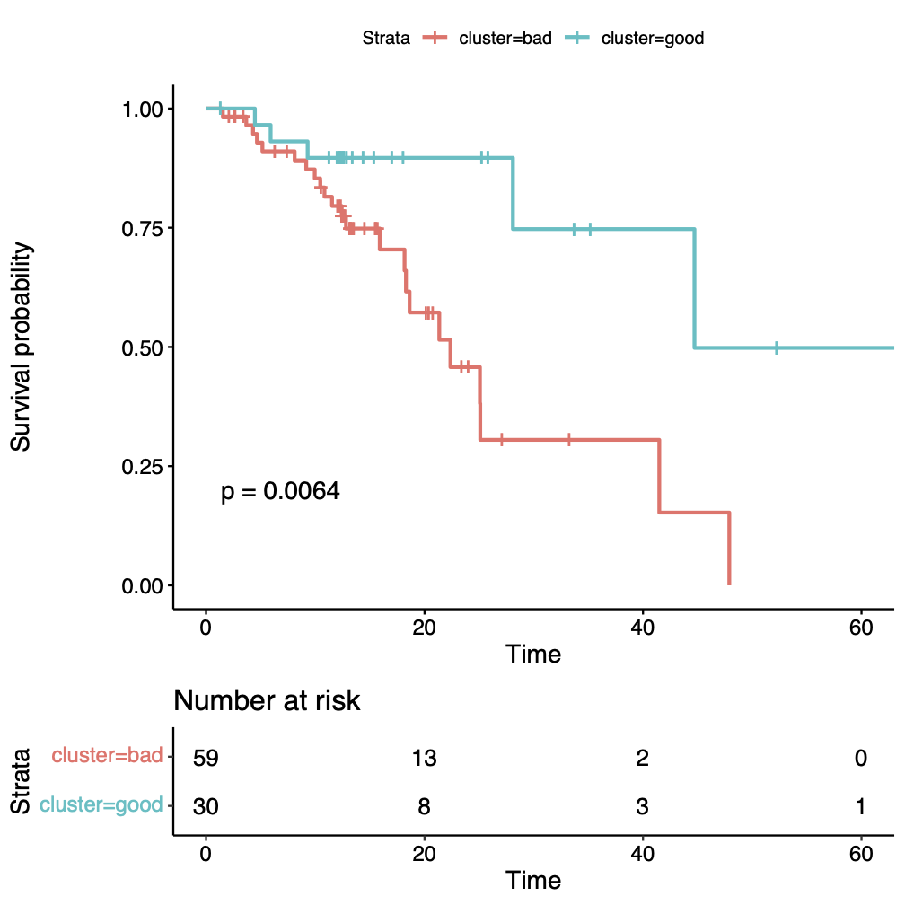
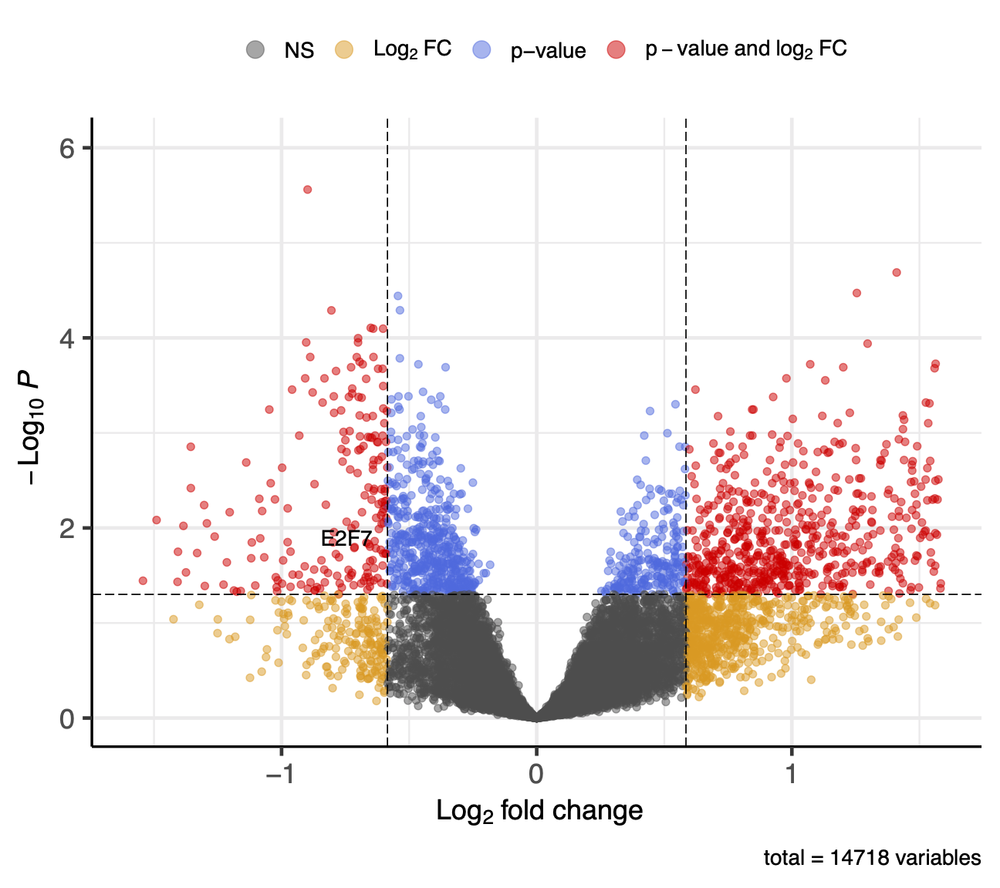

# ESCC_TIME
Tumor Immune MicroEnvironment (TIME) of Esophageal Squamous Cell Carcinoma (ESCC)

Esophageal cancer (ESCA) is the leading cause of digestive system cancer mortality. It is histologically defined by both esophageal squamous cell carcinoma (ESCC) and esophageal adenocarcinoma (EAC). Approximately 90% of ESCA cases worldwide are ESCC (Arnold et al., 2015).

## Subtypes based on Immune Microenvironment

We downloaded both the clinical information and the gene expression data (from RNA Sequencing) of Esophageal Squamous Cell Carcinoma (ESCC) from TCGA. Intersecting the patients from two datasets, we got 89 patients.

Based on the gene expression data, using the method xCell (Aran et al. 2017) embedded in the package `immunedeconv` (Sturm et al. 2020), we inferred the proportions of immune and stromal cell types, and also immune and stroma scores. With the immune microenvironment characteristics, using consensus clustering, the patients were grouped into two clusters. The Kaplan-Meier plot (Fig. 1) on the patients' overall survival showed that there is a significant difference between the two groups (p-value=0.0064 by log-rank test). We can say that there are two subtypes of ESCC based on the immune microenvironment landscape.

We then ran a differencial expression analysis between the two subtypes using `DESeq2`, using the threshold of adjusted P-value < 0.05 and fold change either > 1.5 or < 0.667, 1505 genes are significantly differentially expressed. The volcano plot is shown as Fig. 2. E2F7 is down-regulated with log2(FoldChange) of -0.74 and adjusted P-value of 0.0086.

## References

Aran, Dvir, Zicheng Hu, and Atul J. Butte. "xCell: digitally portraying the tissue cellular heterogeneity landscape." *Genome biology* 18.1 (2017): 1-14.

Arnold, Melina, et al. "Global incidence of oesophageal cancer by histological subtype in 2012." *Gut* 64.3 (2015): 381-387.

Sturm, Gregor, Francesca Finotello, and Markus List. "Immunedeconv: an R package for unified access to computational methods for estimating immune cell fractions from bulk RNA-sequencing data." *Bioinformatics for Cancer Immunotherapy*. Humana, New York, NY, 2020. 223-232.
